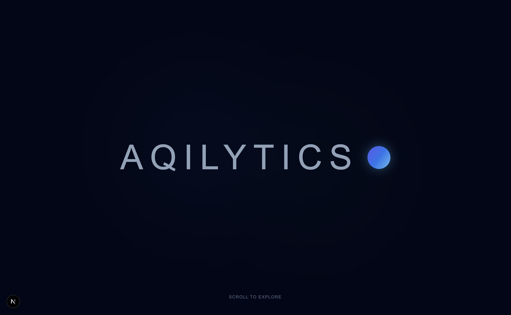
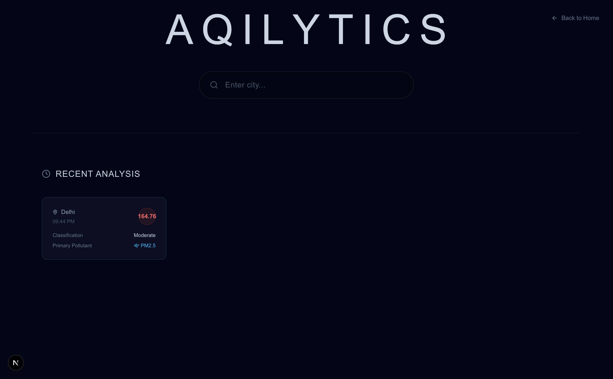
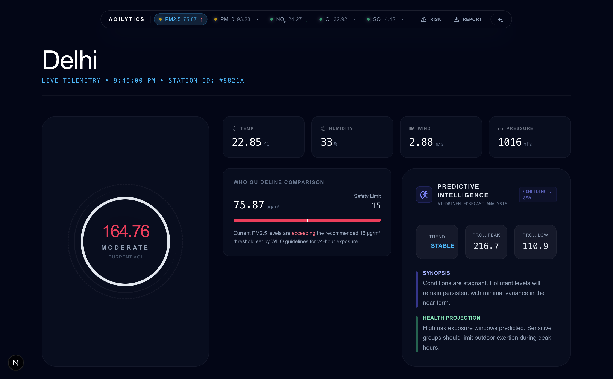
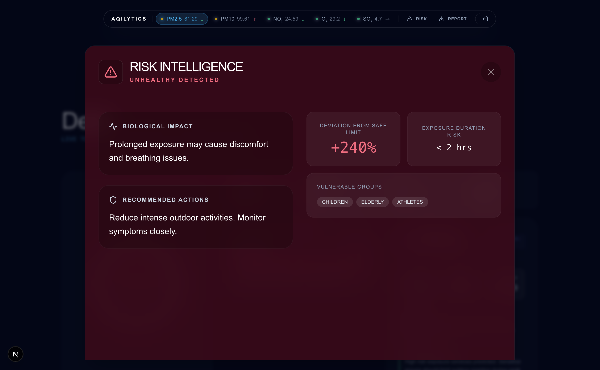
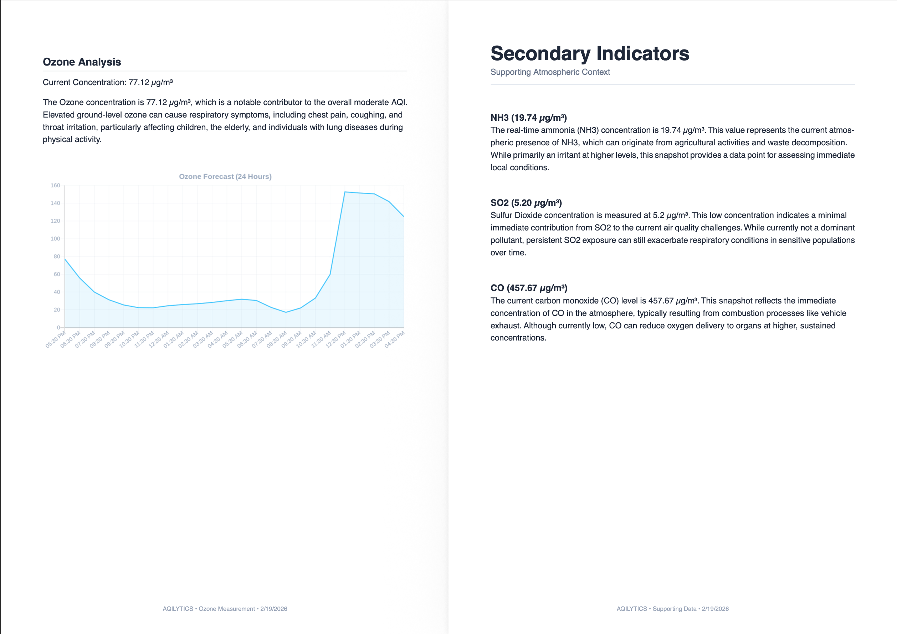
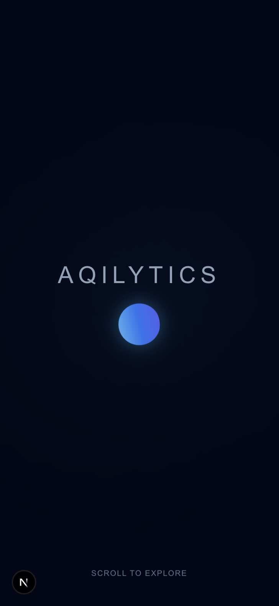
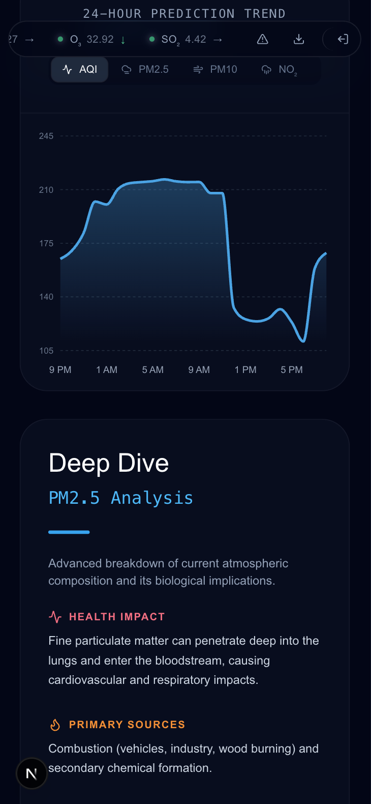
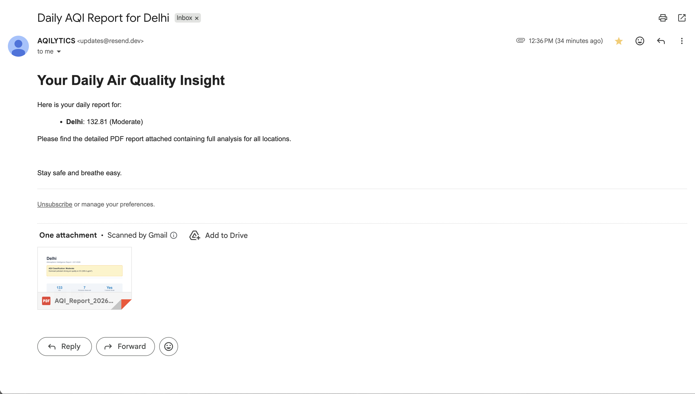

  <h1>🌍 AQILYTICS</h1>
  
<b>Atmospheric intelligence for the modern era. Predicting the unseen to protect the living.</b>

  

    <!-- Add your hosted app link where the "#" is -->
    
  

  

    <!-- Technology Stack Badges -->
    
    
    
    
    
  

  

    <a href="https://github.com/CaSh007s/aqilytics">View Repository on GitHub</a>
  

   
  <!-- Hero Images at the top -->
  

<h2>📖 About the Project</h2>

  AQILYTICS is a full-stack, AI-driven Environmental Dashboard that provides real-time Air Quality Index (AQI) telemetry, 
  cutting-edge machine learning forecasting, and detailed health intelligence using generative AI. 
  It empowers users to track pollutants globally, read AI-generated analyses of the air they breathe, 
  and subscribe to automated daily reports.

<h2>🚀 Core Features</h2>
<ul>
  <li><b>Real-time Global Pulse:</b> Interactive global map and localized searches for granular air quality data.</li>
  <li><b>Machine Learning Forecasts:</b> Next-generation predictions powered by an XGBoost model running on a FastAPI backend.</li>
  <li><b>AI Analyst:</b> Instant, intelligent reports generated by Google Gemini, summarizing the impact of various pollutants (PM2.5, PM10, NO2, SO2, Ozone...).</li>
  <li><b>Daily Briefings:</b> Email subscriptions to receive daily AQI updates for selected cities (powered by Next.js APIs and Resend).</li>
  <li><b>Export Intelligence:</b> Downloadable PDF reports featuring comprehensive analyses.</li>
</ul>

<h2>🛠️ Technology Stack Deep Dive</h2>
<table border="1" cellpadding="10" cellspacing="0" width="100%">
  <tr>
    <th>Domain / Technology</th>
    <th>What It's Doing</th>
  </tr>
  <tr>
    <td><b>Next.js 15 (React 19)</b></td>
    <td>Acts as the core frontend network and orchestrates serverless API routes for email subscriptions and PDF generation. Handles dynamic routing between the dashboard and specific city analyses.</td>
  </tr>
  <tr>
    <td><b>FastAPI (Python)</b></td>
    <td>Powers the high-performance telemetry backend. It ingests geospatial queries, processes real-time weather/pollutant data, and serves the XGBoost ML predictions asynchronously.</td>
  </tr>
  <tr>
    <td><b>XGBoost & Scikit-learn</b></td>
    <td>The machine learning brains of the operation. Trained on historical atmospheric data to generate accurate 5-day Air Quality forecasts for any given location.</td>
  </tr>
  <tr>
    <td><b>Google Gemini 2.5 Flash</b></td>
    <td>The generative AI engine behind the "AI Analyst" feature. It parses raw numeric pollutant data to return formal, human-readable executive health summaries and specific hazard insights.</td>
  </tr>
  <tr>
    <td><b>PostgreSQL (Neon)</b></td>
    <td>The primary relational database storing persistent configuration data such as user email subscriptions, tracked cities, and automated reporting preferences.</td>
  </tr>
  <tr>
    <td><b>Resend</b></td>
    <td>The transactional email service used to dispatch daily automated AQI briefings and handle email verification links for subscribed users.</td>
  </tr>
  <tr>
    <td><b>Tailwind CSS & Framer Motion</b></td>
    <td>Tailwind provides the responsive, utility-first styling system, while Framer Motion handles the complex, physics-based UI orchestration (the breathing orb, layout transitions, animated graphs).</td>
  </tr>
</table>

<h2>📊 Application Workflow</h2>

Below is the architectural workflow detailing how users interact with AQILYTICS from the landing page to generating reports.

  

<h2>📸 Application Showcase</h2>

<table border="0" cellpadding="10" cellspacing="0" width="100%">
  <!-- ROW 1: Desktop Views -->
  <tr>
    <td width="50%" align="center">
      <b>Agent Search (Desktop)</b> 
      
    </td>
    <td width="50%" align="center">
      <b>Result Dashboard (Desktop)</b> 
      
    </td>
  </tr>
  
  <!-- ROW 2: Additional Desktop/Feature Views -->
  <tr>
    <td width="50%" align="center">
      <b>AI Analysis Detail</b> 
      
    </td>
    <td width="50%" align="center">
      <b>Report Generation View</b> 
      
    </td>
  </tr>

  <!-- ROW 3: Mobile Views -->
  <tr>
    <td width="50%" align="center">
      <b>Global Pulse (Mobile)</b> 
      
    </td>
    <td width="50%" align="center">
      <b>Result Dashboard (Mobile)</b> 
      
    </td>
  </tr>
  <!-- ROW 4: Email Feature -->
  <tr>
    <td colspan="2" align="center">
      <b>Daily Email Briefings (Resend)</b> 
      
    </td>
  </tr>
</table>

<h2>👥 Meet the Team</h2>
<table border="1" cellpadding="10" cellspacing="0" width="100%">
  <tr>
    <th width="30%">Member & ID</th>
    <th width="70%">Principal Contributions</th>
  </tr>
  <tr>
    <td><b>Kalash (22BCE11617)</b></td>
    <td><b>System Architect & Lead.</b> Orchestrated the entire full-stack ecosystem, including frontend, backend, AI integration, and the ML pipeline.</td>
  </tr>
  <tr>
    <td><b>Aarav (22BCE10516)</b></td>
    <td><b>ML Engineering.</b> Developed and optimized AQI forecasting models using intensive atmospheric data preprocessing and feature engineering.</td>
  </tr>
  <tr>
    <td><b>Nitin (22BCE10930)</b></td>
    <td><b>Frontend & UX.</b> Crafted the responsive and interactive UI/UX using React, Framer Motion, and Tailwind CSS for a premium feel.</td>
  </tr>
  <tr>
    <td><b>Kavya (22BCE10255)</b></td>
    <td><b>AI Workflows.</b> Designed and engineered advanced AI prompts and workflows to transform raw telemetry into actionable health insights.</td>
  </tr>
  <tr>
    <td><b>Shivangi (22BCE10238)</b></td>
    <td><b>Backend & Cloud.</b> Managed the database architecture, API engineering, deployment lifecycles, and automated delivery systems.</td>
  </tr>
</table>

  <i>Developed with ❤️ for a cleaner, strictly monitored environment.</i>

